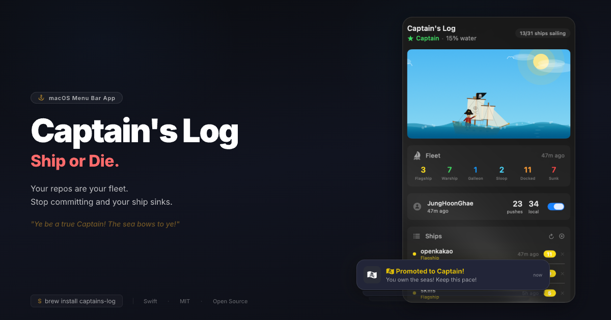

# Captain's Log

[](https://github.com/JungHoonGhae/captains-log/stargazers)
[](https://github.com/JungHoonGhae/captains-log/blob/main/LICENSE)
[](https://swift.org)
[](https://www.apple.com/macos/)
[](https://github.com/JungHoonGhae/captains-log/actions/workflows/ci.yml)

| [](https://github.com/JungHoonGhae) | Follow [@JungHoonGhae](https://github.com/JungHoonGhae) on GitHub for more projects. |
| :-----| :----- |
| [](https://x.com/lucas_ghae) | Follow [@lucas_ghae](https://x.com/lucas_ghae) on X for updates. |

Ship or Die. A pirate-themed macOS menu bar app that gamifies your dev velocity. Stop committing and your ship sinks.

<p align="center">
  
</p>

## Install

```bash
brew tap JungHoonGhae/captains-log && brew install captains-log
```

<details>
<summary>Build from source</summary>

```bash
git clone https://github.com/JungHoonGhae/captains-log.git
cd captains-log && swift build -c release
cp .build/release/CaptainsLog /usr/local/bin/
```

Requires Swift 5.9+ and macOS 13 (Ventura).
</details>

<br />

## The Problem

Dev velocity dies silently.

```
You commit in the morning
  → lunch break
    → "one more scroll"
      → 3 hours pass
        → zero commits

No one notices. No one cares. Except your repos.
They're sinking.
```

There's no ambient pressure to keep shipping. Streak counters are boring. GitHub's contribution graph is too abstract. You need something visceral — **a ship that sinks when you stop coding.**

**Captain's Log puts that pressure in your menu bar.**

<p align="center">
  
</p>

<br />

## What You Get

<table>
<tr>
<td width="50%">

### Pirate Ship Animation

A full Canvas-drawn galleon with hull, masts, sails, rigging, and Jolly Roger. Your pirate captain stands on deck — sword raised when you're shipping, drowning when you're not. The ship physically sinks as your inactivity grows.

</td>
<td width="50%">

### Fleet System

Every repo is a ship in your fleet. Flagships (5+ commits/day), Warships (active today), Galleons, Sloops, Dinghies, and Shipwrecks. See your entire fleet's health at a glance.

</td>
</tr>
<tr>
<td width="50%">

### Rank System

Five pirate ranks based on your water level:
- **Captain** — Shipping like a legend
- **First Mate** — Cruising steady
- **Deckhand** — Ship's taking water
- **Castaway** — Drowning
- **Davy Jones** — Dead. Commit to resurrect.

</td>
<td width="50%">

### GitHub Integration

Auto-detects `gh` CLI login. Tracks push events alongside local commits. Dual-source water level — both local git and GitHub activity keep your ship afloat.

</td>
</tr>
</table>

<br />

## How It Works

```
            Water Level
  0%  ████░░░░░░░░░░░░  Captain    — Ship sailing proudly
 20%  ████████░░░░░░░░  First Mate — Ship lower in water
 40%  ████████████░░░░  Deckhand   — Sails gone, gripping mast
 60%  ██████████████░░  Castaway   — In the water, flailing
 80%  ████████████████  Davy Jones — Only a hand above water
100%  ████████████████  DEAD       — "Commit to Resurrect"
```

Water rises from 0% → 100% over **8 hours** of inactivity. Any commit or push resets it. The animation reflects your status in real-time:

| Water Level | Sky | Sea | Weather | Creatures |
|-------------|-----|-----|---------|-----------|
| 0–25% | Caribbean blue | Turquoise | Seagulls, sunshine | — |
| 25–50% | Golden sunset | Amber waves | Clouds thicken | — |
| 50–75% | Stormy night | Dark red | Rain, stars | Shark fin |
| 75–100% | Abyss black | Blood red | Lightning, heavy rain | Floating debris, drowning hand |

<br />

## Features

- 🏴‍☠️ **Canvas-drawn galleon** — Hull, 2 masts, square sails, jib, rigging, Jolly Roger, cannon ports
- ⚔️ **Pirate captain** — Tricorn hat, red coat, eyepatch, cutlass. Animated per rank
- 🌊 **Multi-layer parallax waves** — 3 wave layers with caustics, foam, bubbles, reflections
- 🦈 **Dynamic environment** — Seagulls, rain, sharks, floating debris, drowning hand
- ⛵ **Fleet tracking** — Each repo classified as a ship type based on commit activity
- 🔔 **Rank notifications** — macOS alerts when you get promoted or demoted
- 🐙 **GitHub integration** — Via `gh` CLI, no token setup needed
- 📂 **Auto-scan repos** — Finds git repos in ~/Projects, ~/Developer, ~/Desktop, etc.
- 🖱️ **Menu bar native** — Always visible, zero friction, pure SwiftUI
- 🌍 **7 languages** — English, Korean, Japanese, Chinese, Spanish, French, German

<br />

## Requirements

| Requirement | Version/Notes |
|-------------|---------------|
| macOS | 13 (Ventura) or later |
| Swift | 5.9+ (build from source) |
| `gh` CLI | Optional — for GitHub push tracking |

<br />

## Configuration

Config is stored at `~/.captains-log.json`:

```json
{
  "repos": ["/Users/you/Projects/my-app", "/Users/you/Projects/api"],
  "githubEnabled": true,
  "hasScannedOnce": true
}
```

- **Add repos**: Click ➕ in the app, or they're auto-discovered on first launch
- **Remove repos**: Click ✕ next to any ship in the fleet list
- **GitHub**: Auto-detected if `gh auth status` shows logged in

<br />

## Support

If this tool helps you, consider supporting its maintenance:

<a href="https://www.buymeacoffee.com/lucas.ghae">
  
</a>

## Contributing

See [CONTRIBUTING.md](CONTRIBUTING.md) for development setup and guidelines.

## License

[MIT](LICENSE) — Lucas ([@lucas_ghae](https://x.com/lucas_ghae))
